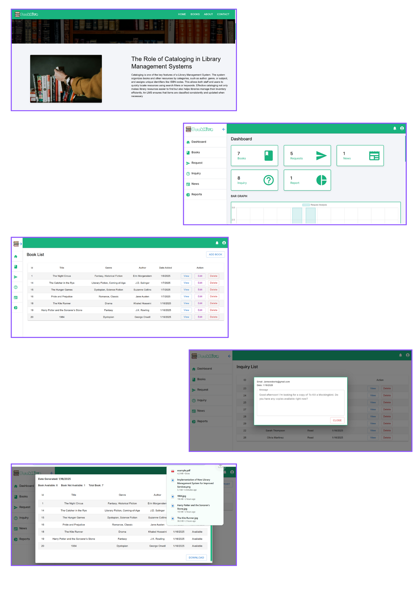

# BookHive - A Dynamic Library Management System

## Overview 📌

The library management system streamlines the process, allowing end users to easily view available books, as well as the latest and most popular titles. Users can send requests for books they wish to read and submit inquiries related to the library. On the admin side, the system provides tools to manage all books, handle user inquiries, and oversee book requests. Additionally, the admin can generate detailed reports, access a comprehensive dashboard to analyze data, and create public notices or news updates about the library, ensuring effective communication with users.

## Features 📌

### Home Page  
- **Introduction Section**: Brief overview of the platform  
- **Benefit Section**: Highlights the advantages of using the platform  
- **Public Notices**: Displays important news and updates about the library  
- **Latest Books**: Showcases the most recent book listings  
- **Popular Books**: Showcases the most popular book listings  

### Book Page  
- **Search & Filter**: Users can search and filter books by various criteria such as:  
    - **Title**: Search books by their title  
    - **Author**: Filter books based on the author’s name  
    - **Genre**: Filter books by genre 
- **View Details**: Detailed view of individual book listings  
- **Send Request**: Allows users to send requests for books they wish to read  

### About Page  
- **Mission & Vision**: Brief overview of the library management system’s goals and purpose  

### Contact Page  
- **Inquiry Form**: Users can send questions or feedback regarding the library  

### Admin Side  
- **Dashboard**:  
    - Total Books  
    - Total News  
    - Total Reports  
    - Total Inquiries  
    - Total Requests  
    - Bar Graph for visual analytics  
    - Latest Transactions  

- **Book Management**:  
    - CRUD (Create, Read, Update, Delete) operations for managing book listings  

- **Request Management**:  
    - View, Approve, and Delete book requests from users  

- **Inquiry Management**:  
    - View and Delete inquiries submitted by users  

- **Report Generation**:  
    - Generate, Download (PDF), View, and Delete reports  

- **News Management**:  
    - CRUD operations for creating and managing news updates and public notices  

- **Login/Logout**  
    - Secure login/logout system for users and admins  

## Tech Stack 📌
- **Frontend**: React, Material UI  
- **Backend**: Express, Node.js  
- **Database**: MySQL  

